Deconvolution analysis of bulk RNAseq of iPSC-derived alveolosphers
treated with the Fibrosis Cocktail (FC)
================

### Table of Contents  

- ["Part 1: Preparation of the single cell dataset"](#part1)

- ["Part 2. Bisque analysis"](#part2)  
    - ["Part 2a. Prepare the bulk data"](#part2a)  
    - ["Part 2b. Prepare the single cell data"](#part2b)  
    - ["Part 2c. Run BisqueRNA"](#part2c)  

<div id="part1"> 

## Part 1: Preparation of the single cell dataset

</div>

### Reanalysis of a previously published single cell GSE150068 for use with reference based deconvolution.

The single cell dataset was first published in Kathiriya et al 2022 (1).
[GSE150068](https://www.ncbi.nlm.nih.gov/geo/query/acc.cgi?acc=GSE150068)

> 1.Kathiriya et al. “Human alveolar type 2 epithelium
> transdifferentiates into metaplastic KRT5+ basal cells” Nature Cell
> Biology v.24 (2022): 10–23.
> <https://doi.org/10.1038/s41556-021-00809-4>

## Workflow Summary

The dataset consists of the raw data from the single cell runs for each
time points individually. In this workflow, we will filter each dataset
and will remove the fibroblasts portion in each of the organoids data
sets and finally will merge the datasets, normalize them, scale them,
and perfrom batch correction through harmonize.

### Load necessary libraries and raw data

load libraries

```{r message=FALSE, warning=FALSE, include=FALSE, paged.print=FALSE}
required.packages <- c("tidyverse", "Seurat", "ggpubr")
lapply(required.packages, library, character.only = TRUE)
```

Load each of the files in a list for processing. NOTE: data must be
first downloaded from the GEO database.

``` r
files <- list.dirs("data/")

dataList <- list()

for (file in files[2:5]){
  fileName <- gsub("data//", "", file)
  print(fileName)
  dataList[[fileName]] <- ReadMtx(paste0("data/",fileName,"/",fileName,"_matrix.mtx"),
                                  cells=paste0("data/",fileName,"/",fileName,"_barcodes.tsv"),
                                  features = paste0("data/",fileName,"/",fileName,"_genes.tsv"))
}
```

    ## [1] "GSM4522986_HT280pos"
    ## [1] "GSM4522987_D7"
    ## [1] "GSM4522988_D14"
    ## [1] "GSM4522989_D21"

Create all Seurat objects in a list

``` r
seurat_objects <- list()

for (file in files[2:5]){
  fileName <- gsub("data//", "", file)
  print(fileName)
  seurat_objects[[fileName]] <- CreateSeuratObject(counts = dataList[[fileName]], project = fileName)
}
```

    ## [1] "GSM4522986_HT280pos"
    ## [1] "GSM4522987_D7"
    ## [1] "GSM4522988_D14"
    ## [1] "GSM4522989_D21"

Split list into individual Seurat objects:

``` r
list2env(seurat_objects,envir=.GlobalEnv)
```

    ## <environment: R_GlobalEnv>

### Day0 dataset: GSM4522986_HT280.

Lets first rename the object to D0 for ease as this part of the dataset
represents day0.

``` r
D0 <- GSM4522986_HT280pos
rm(GSM4522986_HT280pos)
```

#### quality controls:

``` r
D0[["percent.mt"]] <- PercentageFeatureSet(D0, pattern = "^MT-")
D0[["log10GenesPerUMI"]] <- log10(D0$nFeature_RNA) / log10(D0$nCount_RNA)

VlnPlot(D0, features = c("nFeature_RNA", "nCount_RNA", "percent.mt", "log10GenesPerUMI"), ncol = 4)
```

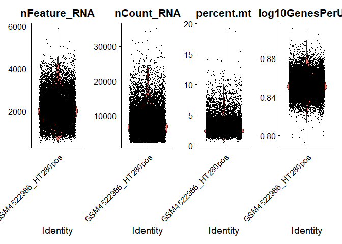<!-- -->

``` r
library(RColorBrewer)
library(ggpubr)
plot1 <- FeatureScatter(D0, feature1 = "nCount_RNA", feature2 = "percent.mt") + geom_vline(xintercept = 200, linetype="dotted", color = "red", size=1) + geom_hline(yintercept = 10, color="red") + geom_hline(yintercept = 15, color="red")
plot2 <- FeatureScatter(D0, feature1 = "nCount_RNA", feature2 = "nFeature_RNA")+ geom_vline(xintercept = 200, linetype="dotted", color = "red", size=1)
plot3 <- FeatureScatter(D0, feature1 = "log10GenesPerUMI", feature2 = "percent.mt") + geom_vline(xintercept = 0.8)
ggarrange(plot1, plot2, plot3, common.legend = TRUE, legend="bottom")
```

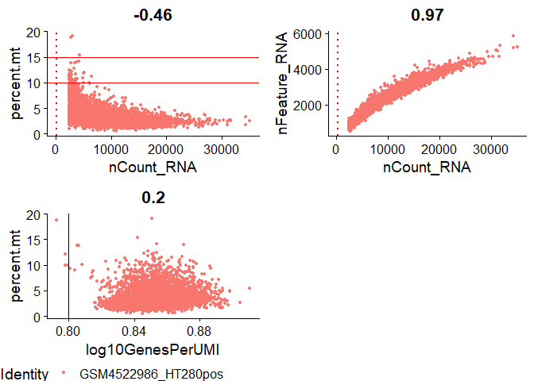<!-- --> Most cells
are of high quality and require little to no filtration. We will subset
the object to remove cells with mitochondrial gene percentage above 10%
and complexity below 0.8

``` r
D0 <- subset(D0, subset = log10GenesPerUMI > 0.8 & percent.mt < 10)
```

NO further processing is needed for this dataset as it is an individual
cell type and there is no need to go into the complexity of the cell
types in this sample.

### Day7 dataset: GSM4522987_D7.

Lets first rename it for ease

``` r
D7 <- GSM4522987_D7
rm(GSM4522987_D7)
```

#### quality controls:

``` r
D7[["percent.mt"]] <- PercentageFeatureSet(D7, pattern = "^MT-")
D7[["log10GenesPerUMI"]] <- log10(D7$nFeature_RNA) / log10(D7$nCount_RNA)


VlnPlot(D7, features = c("nFeature_RNA", "nCount_RNA", "percent.mt", "log10GenesPerUMI"), ncol = 4)
```

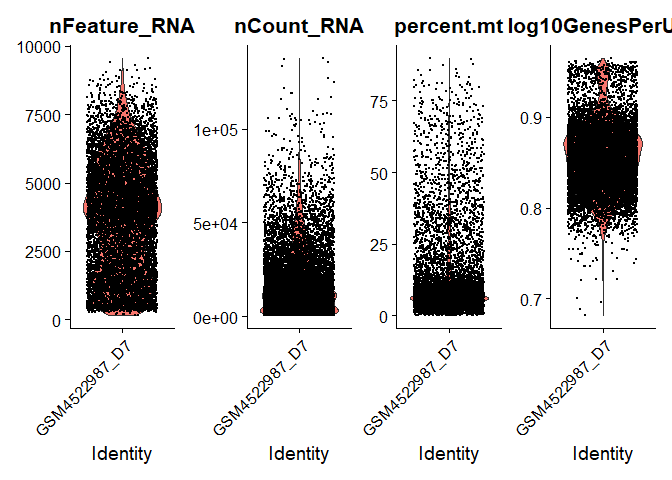<!-- --> The quality
of D7 data set is lower than D0.

``` r
library(RColorBrewer)
library(ggpubr)
plot1 <- FeatureScatter(D7, feature1 = "nCount_RNA", feature2 = "percent.mt") + geom_vline(xintercept = 200, linetype="dotted", color = "red", size=1) + geom_hline(yintercept = 10, color="red") + geom_hline(yintercept = 15, color="red")
plot2 <- FeatureScatter(D7, feature1 = "nCount_RNA", feature2 = "nFeature_RNA")+ geom_vline(xintercept = 200, linetype="dotted", color = "red", size=1)
plot3 <- FeatureScatter(D7, feature1 = "log10GenesPerUMI", feature2 = "percent.mt") + geom_vline(xintercept = 0.8)
ggarrange(plot1, plot2, plot3, common.legend = TRUE, legend="bottom")
```

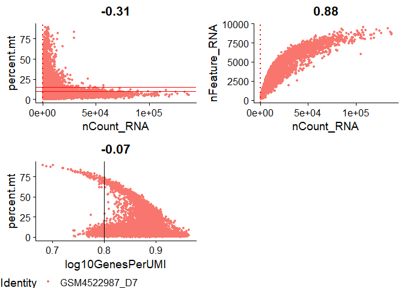<!-- -->

There are a lot of low quality cells evident by high mitochondrial gene
percent and low count. We then will remove cells with high mitochondrial
genes and low count, and this will automatically remove cells with low
complexity.

``` r
D7 <- subset(D7, subset = percent.mt < 15 & nCount_RNA > 500 & nFeature_RNA > 200)
```

### Clustering the data

``` r
D7 <- NormalizeData(D7)
D7 <- FindVariableFeatures(D7, selection.method = "vst", nfeatures = 2000)

top10 <- VariableFeatures(D7) %>% head(10) 

VariableFeaturePlot(D7) %>% LabelPoints(points = top10, repel = TRUE)
```

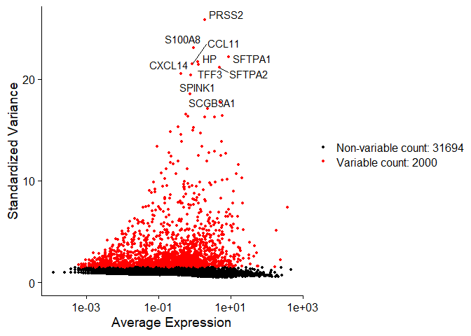<!-- -->

``` r
D7 <- ScaleData(D7, features = head(VariableFeatures(D7), 2000))

D7 <- RunPCA(D7, features = VariableFeatures(D7))
```

``` r
DimPlot(D7, reduction = "pca")
```

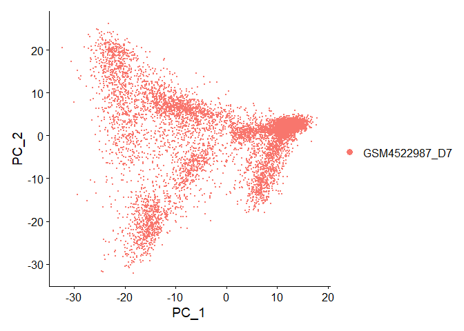<!-- -->

``` r
ElbowPlot(D7)
```

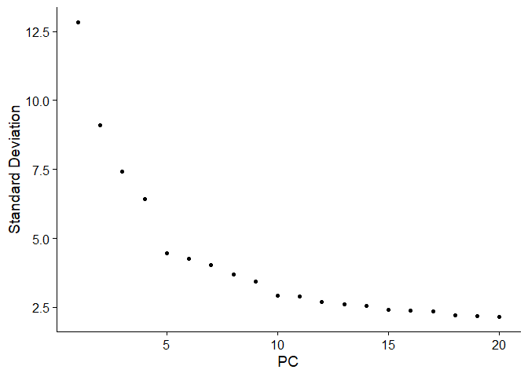<!-- -->

``` r
D7 <- RunUMAP(D7, dims = 1:10)
```

``` r
DimPlot(D7)
```

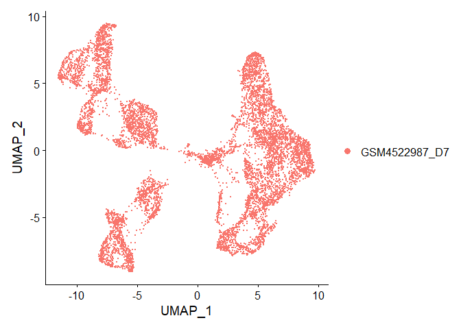<!-- -->

``` r
set.seed(1960)
D7 <- FindNeighbors(D7, dims = 1:10)
D7 <- FindClusters(D7,resolution = 0.5)
```

    ## Modularity Optimizer version 1.3.0 by Ludo Waltman and Nees Jan van Eck
    ## 
    ## Number of nodes: 8223
    ## Number of edges: 267103
    ## 
    ## Running Louvain algorithm...
    ## Maximum modularity in 10 random starts: 0.9153
    ## Number of communities: 14
    ## Elapsed time: 0 seconds

``` r
DimPlot(D7)
```

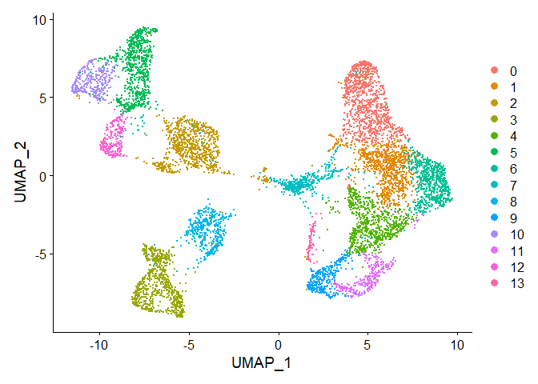<!-- -->

``` r
FeaturePlot(D7, features = c("SFTPC", "CDH1", "EPCAM", "COL1A1", "FBLN1","PDGFRA"))
```

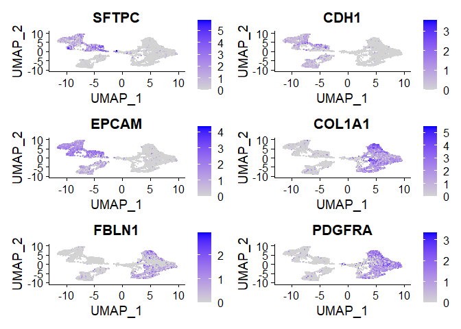<!-- -->

``` r
DotPlot(D7, features = c("SFTPC", "CDH1", "EPCAM", "COL1A1", "FBLN1","PDGFRA", "KRT14", "KRT8", "KRT5"))
```

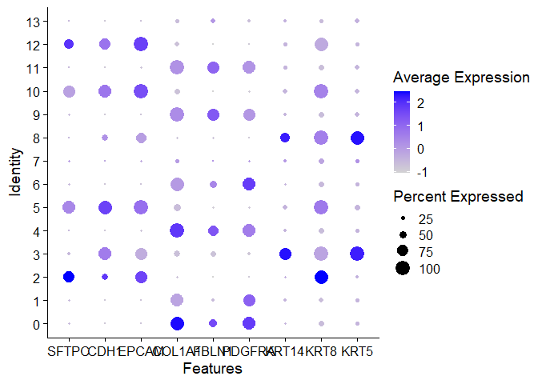<!-- --> Based on the
Dotplots of the specified features, we can expect that the following
clusters are epithelial:

2,3,5,8,10,12 (epithelial)

0,1,4,6,9,11 (Mesenchymal)

Clusters 7 and 13 cluster with mesenchymal cells, but they do not have
the specific markers we looked at. Before deciding to exclude them, we
can do differential expression to see what their top markrers are:

``` r
D7.7 <- FindMarkers(D7, ident.1 = 7)
D7.7 %>% arrange(desc(avg_log2FC))
```

    ##                     p_val avg_log2FC pct.1 pct.2     p_val_adj
    ## CRYAB        2.889339e-16  0.8477980 0.027 0.173  9.735337e-12
    ## HIST1H1E     1.227591e-33  0.6734033 0.131 0.482  4.136246e-29
    ## LRRC75A      1.445790e-10  0.6394369 0.117 0.280  4.871446e-06
    ## DDIT4        8.248582e-16  0.6070708 0.250 0.558  2.779277e-11
    ## MTRNR2L12    1.567487e-51  0.6051733 0.340 0.976  5.281489e-47
    ## CXCL5        4.574889e-01  0.5987358 0.423 0.591  1.000000e+00
    ## PLCG2        3.211097e-52  0.5570590 0.242 0.782  1.081947e-47
    ## S100A2       6.584114e-92  0.5496646 0.956 0.993  2.218451e-87
    ## PDXDC1       3.788659e-41  0.5294002 0.110 0.486  1.276551e-36
    ## SNHG25       4.683347e-38  0.5011275 0.110 0.468  1.578007e-33
    
``` r
D7.13 <- FindMarkers(D7, ident.1 = 13)
D7.13 %>% arrange(desc(avg_log2FC))
```

    ##                      p_val avg_log2FC pct.1 pct.2    p_val_adj
    ## TAGLN         6.030543e-33  3.1769657 0.725 0.270 2.031931e-28
    ## VIM           8.663411e-50  2.5109293 1.000 0.953 2.919050e-45
    ## UBE2S         2.661063e-46  2.5010383 0.967 0.773 8.966186e-42
    ## PTTG1         1.284439e-48  2.3327699 0.956 0.560 4.327788e-44
    ## C12orf75      5.248194e-51  2.1493932 0.934 0.489 1.768326e-46
    ## TPM2          3.226884e-46  2.0972846 0.967 0.707 1.087266e-41
    ## CDKN3         1.815161e-48  2.0004768 0.868 0.334 6.116005e-44
    ## STMN1         6.955956e-38  1.7914436 0.912 0.611 2.343740e-33
    ## BIRC5         1.403514e-54  1.7892237 0.901 0.339 4.728999e-50
    ## LGALS1        9.934566e-45  1.7757207 1.000 0.985 3.347353e-40
   

Clusters 7 and 13 do not show any indication that they may belong to the
epithelial cells.. We will therefore remove these cells from the data
set and only keep the epithelial ones.

``` r
D7 <- subset(D7, idents = c(2,3,5,8,10,12))
```

### Day14 dataset: GSM4522988_D14.

Lets first rename it for ease

``` r
D14 <- GSM4522988_D14
rm(GSM4522988_D14)
```

#### quality controls:

``` r
D14[["percent.mt"]] <- PercentageFeatureSet(D14, pattern = "^MT-")
D14[["log10GenesPerUMI"]] <- log10(D14$nFeature_RNA) / log10(D14$nCount_RNA)


VlnPlot(D14, features = c("nFeature_RNA", "nCount_RNA", "percent.mt", "log10GenesPerUMI"), ncol = 4)
```

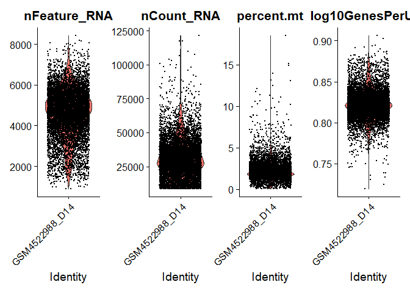<!-- --> The quality
of D14 seems much better than D7

``` r
library(RColorBrewer)
library(ggpubr)
plot1 <- FeatureScatter(D14, feature1 = "nCount_RNA", feature2 = "percent.mt") + geom_vline(xintercept = 200, linetype="dotted", color = "red", size=1) + geom_hline(yintercept = 10, color="red") + geom_hline(yintercept = 15, color="red")
plot2 <- FeatureScatter(D14, feature1 = "nCount_RNA", feature2 = "nFeature_RNA")+ geom_vline(xintercept = 200, linetype="dotted", color = "red", size=1)
plot3 <- FeatureScatter(D14, feature1 = "log10GenesPerUMI", feature2 = "percent.mt") + geom_vline(xintercept = 0.8)
ggarrange(plot1, plot2, plot3, common.legend = TRUE, legend="bottom")
```

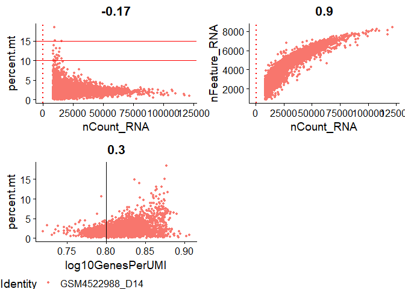<!-- -->

``` r
D14 <- subset(D14, subset = percent.mt < 15 & nCount_RNA > 500 & nFeature_RNA > 200)
```

### Clustering the data

``` r
D14 <- NormalizeData(D14)
D14 <- FindVariableFeatures(D14, selection.method = "vst", nfeatures = 2000)

top10 <- VariableFeatures(D14) %>% head(10) 

VariableFeaturePlot(D14) %>% LabelPoints(points = top10, repel = TRUE)
```

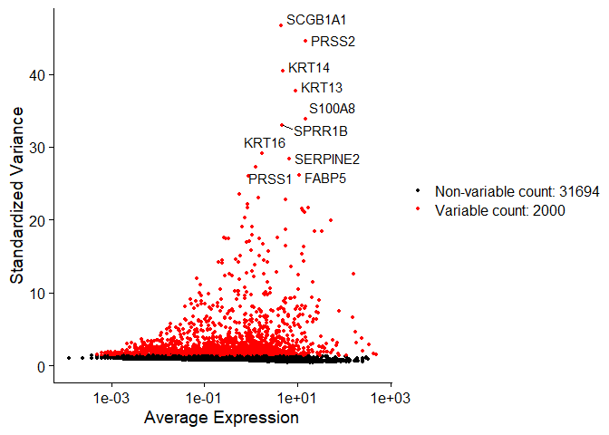<!-- -->

``` r
D14 <- ScaleData(D14, features = head(VariableFeatures(D14), 2000))

D14 <- RunPCA(D14, features = VariableFeatures(D14))
```

``` r
DimPlot(D14, reduction = "pca")
```

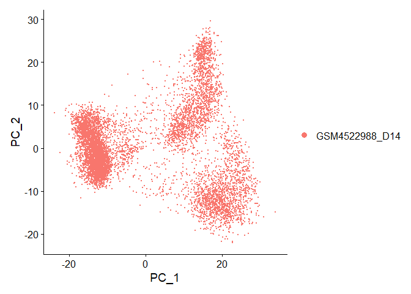<!-- -->

``` r
ElbowPlot(D14)
```

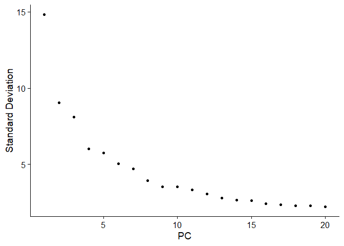<!-- -->

``` r
set.seed(1973)
D14 <- RunUMAP(D14, dims = 1:10)
```

``` r
DimPlot(D14)
```

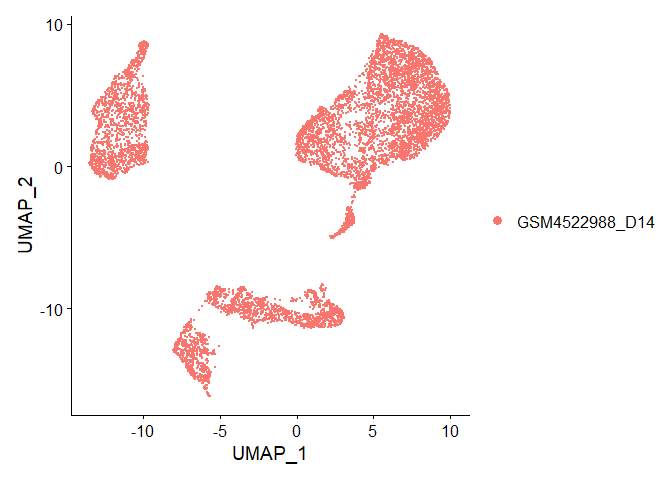<!-- -->

``` r
set.seed(1960)
D14 <- FindNeighbors(D14, dims = 1:10)
D14 <- FindClusters(D14,resolution = 0.1)
```

    ## Modularity Optimizer version 1.3.0 by Ludo Waltman and Nees Jan van Eck
    ## 
    ## Number of nodes: 8146
    ## Number of edges: 254575
    ## 
    ## Running Louvain algorithm...
    ## Maximum modularity in 10 random starts: 0.9678
    ## Number of communities: 6
    ## Elapsed time: 0 seconds

``` r
DimPlot(D14)
```

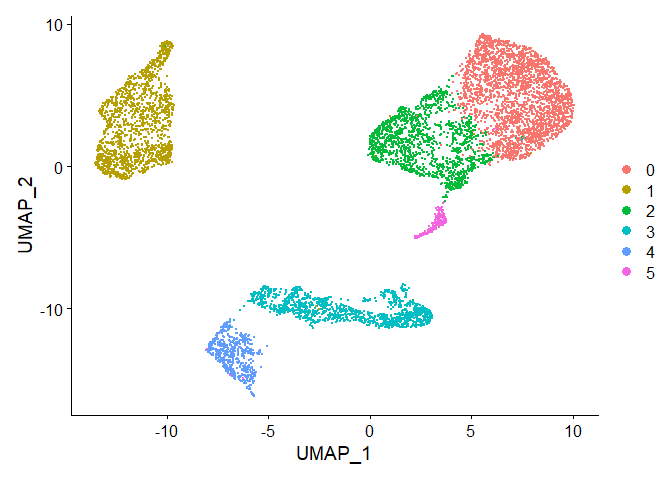<!-- -->

``` r
FeaturePlot(D14, features = c("SFTPC", "CDH1", "EPCAM", "COL1A1", "FBLN1","PDGFRA"))
```

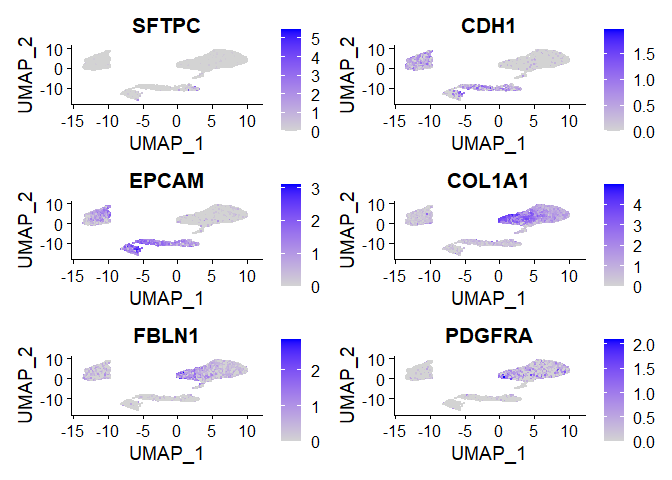<!-- -->

``` r
DotPlot(D14, features = c("SFTPC", "CDH1", "EPCAM", "COL1A1", "FBLN1","PDGFRA", "KRT14", "KRT8", "KRT5", "KRT17"))
```

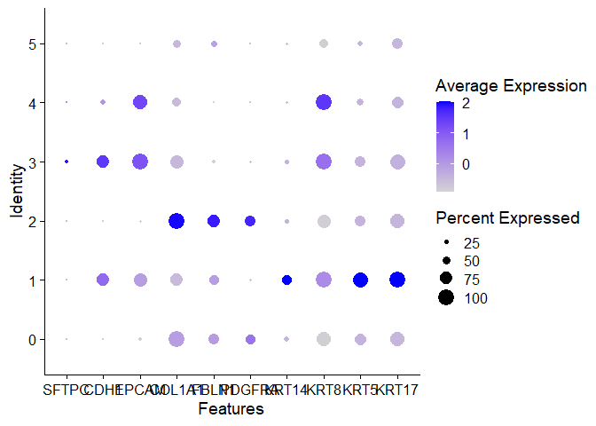<!-- --> Based on the
Dotplots of the specified features, we can expect that the following
clusters are epithelial:

CLusters 1,3, and 4 are epithelial. Cluster 5 is questionable. However,
some of the cells in it express KRT17 and KRT8, which may mean that they
are part of the transitional cells we observe in IPF. Therefore, we will
keep 1,3,4,5.

``` r
D14 <- subset(D14, idents = c(1,3,4,5))
```

### Day21 dataset: GSM4522989_D21.

Lets first rename it for ease

``` r
D21 <- GSM4522989_D21
rm(GSM4522989_D21)
```

#### quality controls:

``` r
D21[["percent.mt"]] <- PercentageFeatureSet(D21, pattern = "^MT-")
D21[["log10GenesPerUMI"]] <- log10(D21$nFeature_RNA) / log10(D21$nCount_RNA)


VlnPlot(D21, features = c("nFeature_RNA", "nCount_RNA", "percent.mt", "log10GenesPerUMI"), ncol = 4)
```

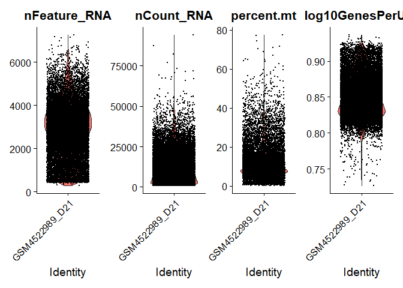<!-- --> The quality
of D21 is lower than D0 and D14. It is comparable to D7 in quality

``` r
library(RColorBrewer)
library(ggpubr)
plot1 <- FeatureScatter(D21, feature1 = "nCount_RNA", feature2 = "percent.mt") + geom_vline(xintercept = 200, linetype="dotted", color = "red", size=1) + geom_hline(yintercept = 10, color="red") + geom_hline(yintercept = 15, color="red")
plot2 <- FeatureScatter(D21, feature1 = "nCount_RNA", feature2 = "nFeature_RNA")+ geom_vline(xintercept = 200, linetype="dotted", color = "red", size=1)
plot3 <- FeatureScatter(D21, feature1 = "log10GenesPerUMI", feature2 = "percent.mt") + geom_vline(xintercept = 0.8)
ggarrange(plot1, plot2, plot3, common.legend = TRUE, legend="bottom")
```

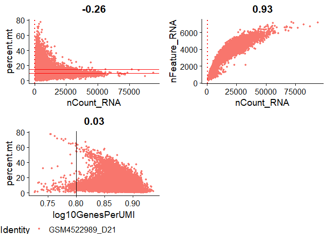<!-- -->

``` r
D21 <- subset(D21, subset = percent.mt < 15 & nCount_RNA > 500 & nFeature_RNA > 200)
```

### Clustering the data

``` r
D21 <- NormalizeData(D21)
D21 <- FindVariableFeatures(D21, selection.method = "vst", nfeatures = 2000)

top10 <- VariableFeatures(D21) %>% head(10) 

VariableFeaturePlot(D21) %>% LabelPoints(points = top10, repel = TRUE)
```

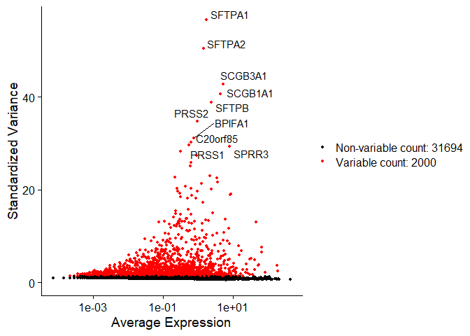<!-- -->

``` r
D21 <- ScaleData(D21, features = head(VariableFeatures(D21), 2000))

D21 <- RunPCA(D21, features = VariableFeatures(D21))
```

``` r
DimPlot(D21, reduction = "pca")
```

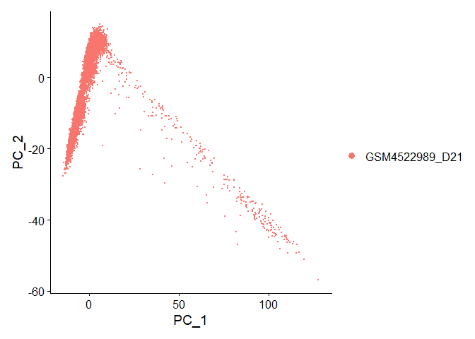<!-- -->

``` r
ElbowPlot(D21)
```

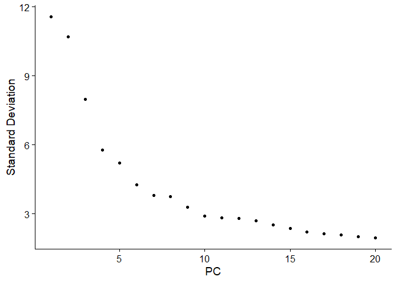<!-- -->

``` r
set.seed(1973)
D21 <- RunUMAP(D21, dims = 1:15)
```

``` r
DimPlot(D21)
```

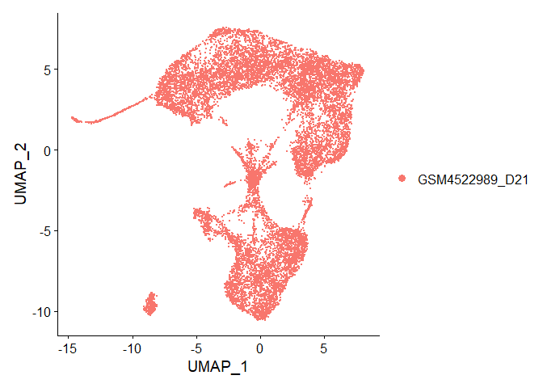<!-- -->

``` r
set.seed(1960)
D21 <- FindNeighbors(D21, dims = 1:20)
D21 <- FindClusters(D21,resolution = 0.1)
```

    ## Modularity Optimizer version 1.3.0 by Ludo Waltman and Nees Jan van Eck
    ## 
    ## Number of nodes: 13477
    ## Number of edges: 457925
    ## 
    ## Running Louvain algorithm...
    ## Maximum modularity in 10 random starts: 0.9577
    ## Number of communities: 6
    ## Elapsed time: 1 seconds

``` r
DimPlot(D21)
```

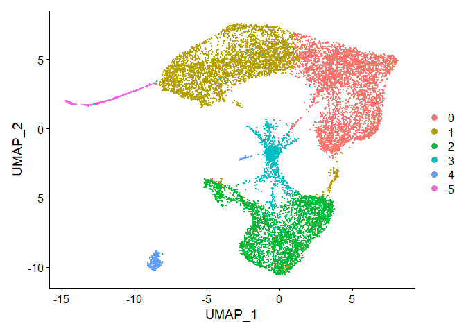<!-- -->

``` r
FeaturePlot(D21, features = c("SFTPC", "CDH1", "EPCAM", "COL1A1", "FBLN1","PDGFRA", "KRT8", "KRT17"))
```

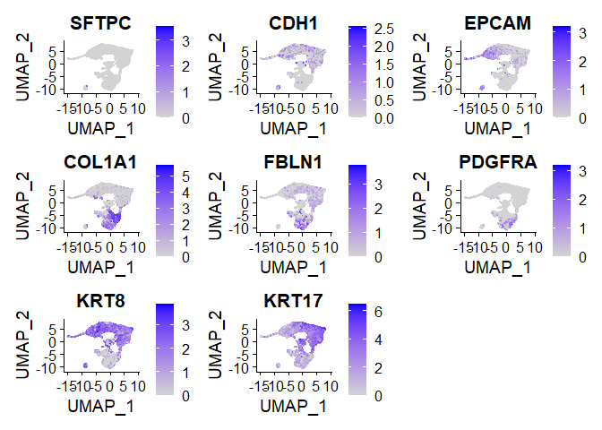<!-- -->

``` r
DotPlot(D21, features = c("SFTPC", "CDH1", "EPCAM", "COL1A1", "FBLN1","PDGFRA", "KRT14", "KRT8", "KRT5", "KRT17"))
```

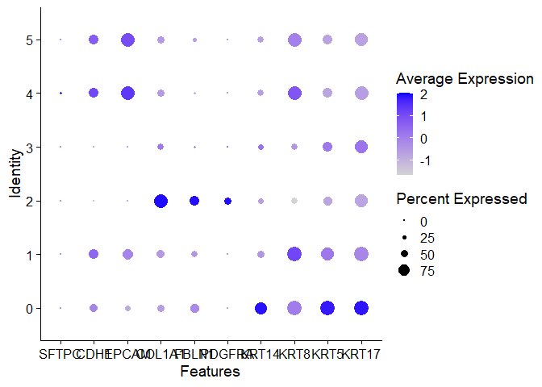<!-- --> Cluster 2
seems to be the only cluster with a mesenchumal signature among all the
other cell types. THus, we will remove it moving forward. Cluster 3 is
quesionable but it is somewhat positive for krt8 and krt17

``` r
D21 <- subset(D21, idents = c(0,1,3,4,5))
```

``` r
saveRDS(D0, file = "D0.rds")
saveRDS(D7, file = "D7.rds")
saveRDS(D14, file = "D14.rds")
saveRDS(D21, file = "D21.rds")
```

### Combinging all timepoints into 1 dataset

Combine all seurat objects into one

``` r
hAO <- merge(D0, y=c(D7,D14,D21), add.cell.ids=c("D0","D7","D14","D21"), project="hAEC2orgs")
Idents(hAO) <- hAO$orig.ident
#rm(D0,D7,D14,D21)
#rm(seurat_objects, GSM4522986_HT280pos, GSM4522987_D7, dataList)
```

### Quick check on quality followed by scaling and normalizing the data

``` r
VlnPlot(hAO, features = c("nFeature_RNA", "nCount_RNA", "percent.mt", "log10GenesPerUMI"), ncol = 4)
```

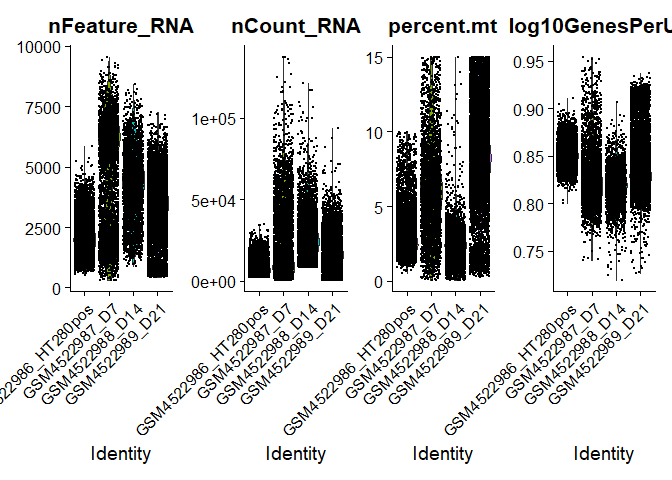<!-- -->

``` r
plot1 <- FeatureScatter(hAO, feature1 = "nCount_RNA", feature2 = "percent.mt") + geom_vline(xintercept = 200, linetype="dotted", color = "red", size=1) + geom_hline(yintercept = 10, color="red") + geom_hline(yintercept = 15, color="red")
plot2 <- FeatureScatter(hAO, feature1 = "nCount_RNA", feature2 = "nFeature_RNA")+ geom_vline(xintercept = 200, linetype="dotted", color = "red", size=1)
plot3 <- FeatureScatter(hAO, feature1 = "log10GenesPerUMI", feature2 = "percent.mt") + geom_vline(xintercept = 0.8)
ggarrange(plot1, plot2, plot3, common.legend = TRUE, legend="bottom")
```

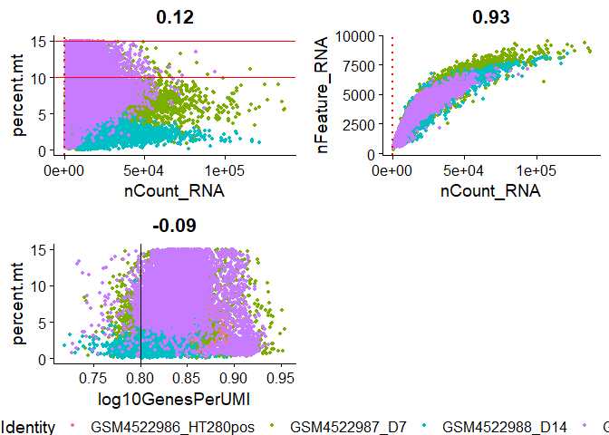<!-- -->

Normalize and scale with SCT

``` r
hAO <- NormalizeData(hAO)

hAO <- FindVariableFeatures(hAO,selection.method = "vst")

hAO <- ScaleData(hAO)
hAO <- RunPCA(hAO, verbose = F)

DimPlot(hAO, reduction = "pca")
```

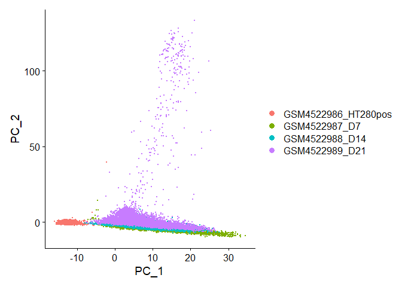<!-- -->

``` r
ElbowPlot(hAO)
```

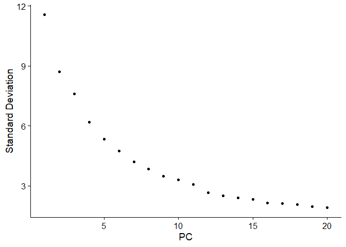<!-- -->

``` r
library(harmony)
hAOH <- hAO
set.seed(19601025)
hAOH <- RunHarmony(hAOH, group.by.vars = "orig.ident", dims.use = 1:15)
```

``` r
ElbowPlot(hAOH, reduction = "harmony")
```

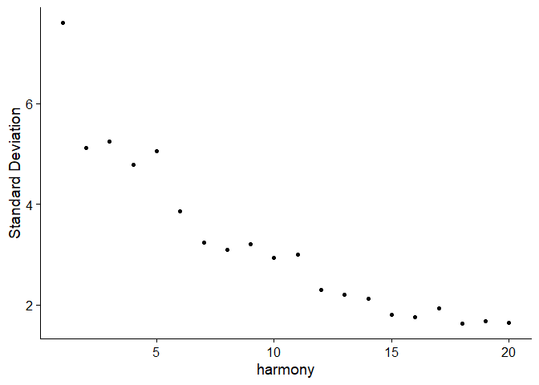<!-- -->

``` r
DimPlot(hAOH, reduction = "harmony")
```

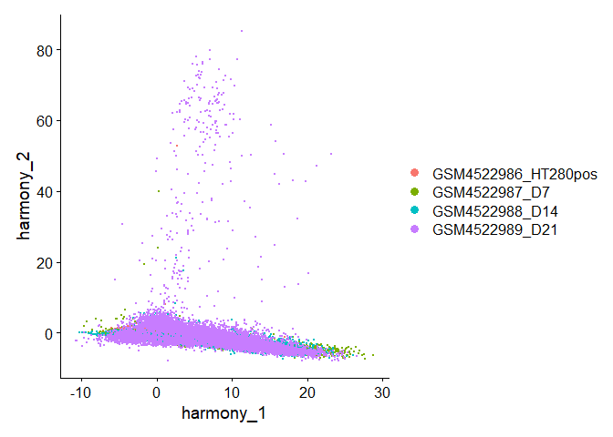<!-- -->

``` r
set.seed(1915)
hAOH <- RunUMAP(hAOH, dims = 1:10, reduction = "harmony")
```

``` r
DimPlot(hAOH)
```

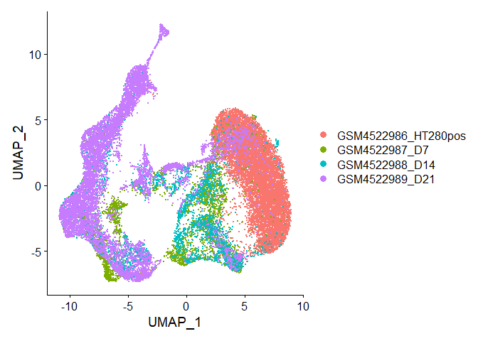<!-- -->

``` r
set.seed(1973)
hAOH <- FindNeighbors(hAOH, dims = 1:15, reduction = "harmony")
hAOH <- FindClusters(hAOH, resolution = 0.4)
```

    ## Modularity Optimizer version 1.3.0 by Ludo Waltman and Nees Jan van Eck
    ## 
    ## Number of nodes: 28673
    ## Number of edges: 921588
    ## 
    ## Running Louvain algorithm...
    ## Maximum modularity in 10 random starts: 0.9217
    ## Number of communities: 13
    ## Elapsed time: 5 seconds

``` r
DimPlot(hAOH)
```

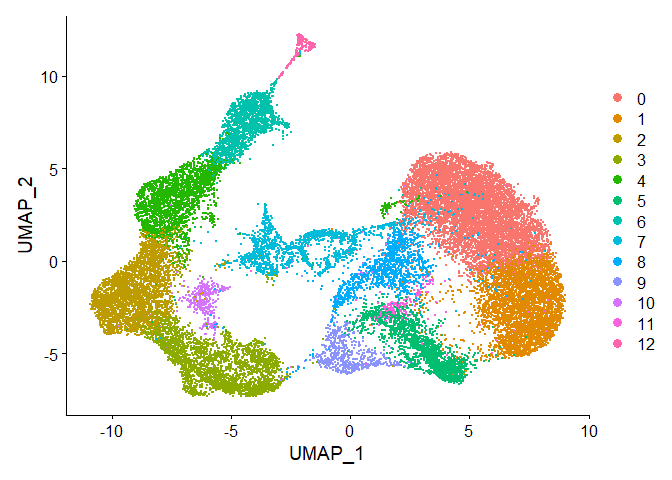<!-- -->

Ok Lets try to identify the clusters now.

Lets first look at the common markers to get the main cells out of thw
way. We will look at the proximal markers

``` r
DotPlot(hAOH, features = c("KRT5", "TP63", "KRT14", "KRT17", "FOXJ1", "SCGB1A1", "MUC5AC"))
```

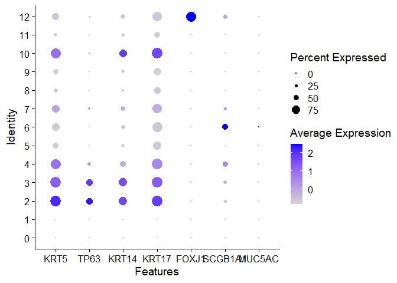<!-- -->

``` r
FeaturePlot(hAOH, c("KRT5", "TP63", "KRT14", "KRT17", "FOXJ1", "SCGB1A1", "MUC5AC"))
```

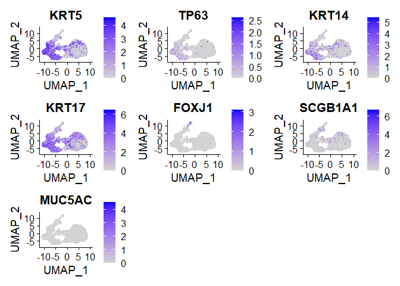<!-- -->

Cluster 12 is ciliated cells

Cluster 6 is club cells

Cluster 4 is basal to club (This seems to be a transilitional state
between basal and club cells)

Clusters 2, 3, 10 are basal cells

Lets check alveolar next

``` r
DotPlot(hAOH, features = c("SFTPC", "LAMP3", "ABCA3"))
```

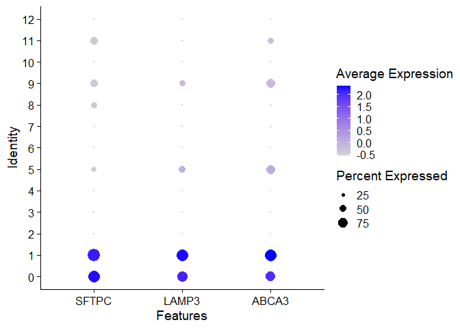<!-- --> Clusters 0
and 1 are mature ATII cells

``` r
Idents(hAOH, cells=WhichCells(hAOH, idents = c(0,1))) <- "AEC2"
Idents(hAOH, cells=WhichCells(hAOH, idents = c(12))) <- "Ciliated"
Idents(hAOH, cells=WhichCells(hAOH, idents = c(6))) <- "Club"
Idents(hAOH, cells=WhichCells(hAOH, idents = c(2,3,10))) <- "Basal"
Idents(hAOH, cells=WhichCells(hAOH, idents = c(4))) <- "Basal_to_Club"
DimPlot(hAOH)
```

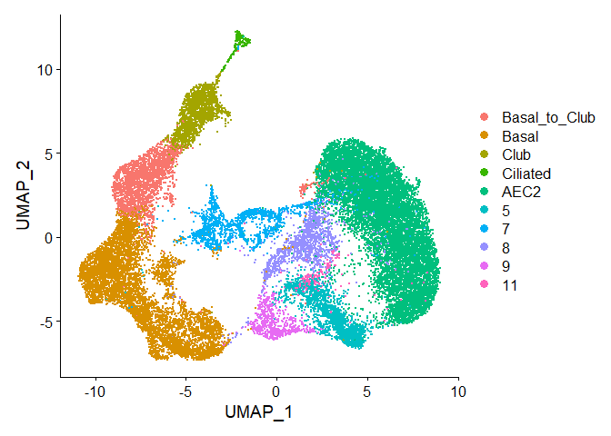<!-- -->

We can fist check the markers associated with ABI cells described in the
published paper: ABI1 is described as being SFTPC+ KRT17 low and KRT8
high ABI2 is described as being SFTPC- KRT17+ KRT5- KRT8high

``` r
FeaturePlot(hAOH, features = c("SFTPC", "KRT5", "KRT8", "KRT17"))
```

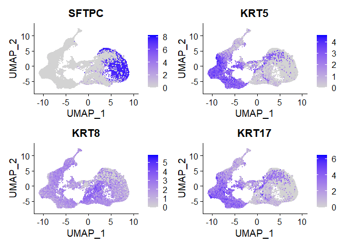<!-- -->

``` r
DotPlot(hAOH, features = c("SFTPC", "KRT5", "KRT8", "KRT17"))
```

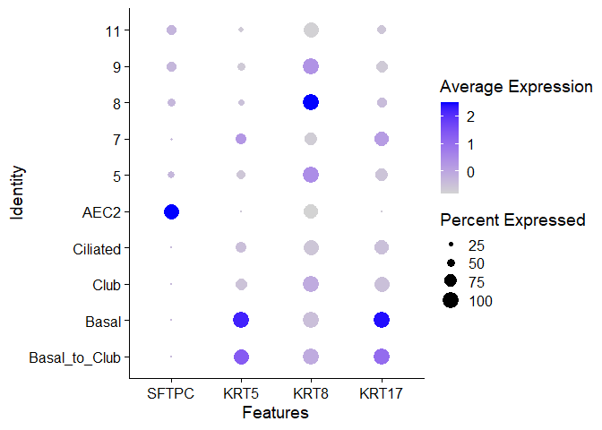<!-- -->

``` r
DotPlot(hAOH, features = c("TM4SF1","FN1", "CLDN4", "TAGLN", "MDK", "CTSE", "CALD1", "COL1A1"))
```

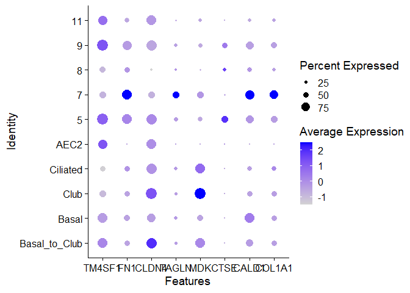<!-- -->

According to these features and based on the publication figure 6i

Cluster 7 represents ABI2 and clusters 5, 8 and 9, 11 are ABI1

``` r
Idents(hAOH, cells=WhichCells(hAOH, idents = c(7))) <- "ABI2"
Idents(hAOH, cells=WhichCells(hAOH, idents = c(5,8,9,11))) <- "ABI1"
```

``` r
DimPlot(hAOH)
```

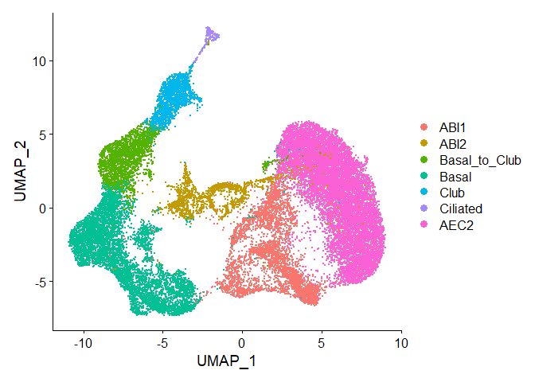<!-- -->

Let’s add the clustering of the cells as a column in the metadata and
export the metadata file to use in bisque.

``` r
hAOH$population <- Idents(hAOH)

library(stringr)

hAOH$timepoint <- str_extract(rownames(hAOH@meta.data),"[^_]+")

hAOH@meta.data %>%  head()
```

    ##                                orig.ident nCount_RNA nFeature_RNA percent.mt
    ## D0_AAACCTGAGAGCTTCT-1 GSM4522986_HT280pos       4755         1495   3.911672
    ## D0_AAACCTGAGATCGGGT-1 GSM4522986_HT280pos       5875         1882   4.017021
    ## D0_AAACCTGAGGATCGCA-1 GSM4522986_HT280pos       5902         1504   3.320908
    ## D0_AAACCTGAGGCTACGA-1 GSM4522986_HT280pos      12425         2990   1.416499
    ## D0_AAACCTGAGTAAGTAC-1 GSM4522986_HT280pos      13978         3231   1.595364
    ## D0_AAACCTGAGTCCATAC-1 GSM4522986_HT280pos       9419         2412   5.722476
    ##                       log10GenesPerUMI RNA_snn_res.0.5 seurat_clusters
    ## D0_AAACCTGAGAGCTTCT-1        0.8633427            <NA>               0
    ## D0_AAACCTGAGATCGGGT-1        0.8688280            <NA>               0
    ## D0_AAACCTGAGGATCGCA-1        0.8425480            <NA>               0
    ## D0_AAACCTGAGGCTACGA-1        0.8489056            <NA>               1
    ## D0_AAACCTGAGTAAGTAC-1        0.8465525            <NA>               5
    ## D0_AAACCTGAGTCCATAC-1        0.8511256            <NA>               1
    ##                       RNA_snn_res.0.1 RNA_snn_res.0.4 population timepoint
    ## D0_AAACCTGAGAGCTTCT-1            <NA>               0       AEC2        D0
    ## D0_AAACCTGAGATCGGGT-1            <NA>               0       AEC2        D0
    ## D0_AAACCTGAGGATCGCA-1            <NA>               0       AEC2        D0
    ## D0_AAACCTGAGGCTACGA-1            <NA>               1       AEC2        D0
    ## D0_AAACCTGAGTAAGTAC-1            <NA>               5       ABI1        D0
    ## D0_AAACCTGAGTCCATAC-1            <NA>               1       AEC2        D0

``` r
write.csv(hAOH@meta.data, file = "hAOH_metadata.csv")
```
<div id="part2"> 

## Part 2. Bisque anaysis using the reference dataset prepared in [Part1](#part1)</a>
</div>

The goal of this analysis is to deconvolute bulk RNAseq data from iPSC
derived alveolospheres that are treated with/out the fibrosis cocktail
(FC). FC conists of: TGF-beta, TNF-a, PDGF-AB, and LPA.

Bulk RNAseq was performed as indicated in the manuscript.

load the necessary libraries
```{r echo=TRUE}
pckgs <- c("BisqueRNA", "Biobase", "biomaRt","Matrix", "tidyverse", "Seurat", "ade4")
lapply(pckgs, library, character.only=TRUE)
```


<div id="part2a"> 

### Preparation of the bulk data for analysis
</div>

The data has to be first prepared into an expressionSet in order to be
inputted into BisqueRNA.

``` r
pcounts <- read.csv("annotated_combined.counts", sep = "\t", stringsAsFactors = F, header = T)
pcounts %>% dplyr::select(contains(c("id","X1_S1", "S2", "S3", "S4", "S5", "S6"))) -> pcounts
rownames(pcounts) <- pcounts$id
pcounts$id <- NULL
colnames(pcounts) <- paste0("S", seq(1, 6))
head(pcounts)
```

    ##                 S1 S2 S3 S4 S5 S6
    ## ENSG00000223972  1  0  0  2  1  0
    ## ENSG00000227232 75 41 56 45 90 48
    ## ENSG00000278267  5  7  5  4  7  2
    ## ENSG00000243485  0  0  0  0  0  0
    ## ENSG00000284332  0  0  0  0  0  0
    ## ENSG00000237613  0  0  0  0  0  0

#### Filtration of the data

``` r
### remove zero rows 
pcounts <- pcounts[rowSums(pcounts)>0,]


### to be considered expressed, a gene has to be present in 2 out of 3 samples
### s2c dataframe is the metadata for bulk RNAseq. it is generated when the bulk data is processed.
groups <- as.character(unique(s2c$Stimulus))
expressed <- pcounts[,0]

for (i in 1: length(groups)){
  ex <- pcounts[,colnames(pcounts)%in%s2c[s2c$Stimulus==groups[i],]$sampleID]
  zeros <- apply(ex, 1, function(x) length(which(x==0)))
  flamingo <- rep(1,nrow(pcounts))
  flamingo[zeros>1]<-0
  table(flamingo)
  expressed <- cbind(expressed,flamingo)
  colnames(expressed)[i] <- groups[i]
}
head(expressed)
```

    ##                 CC FC
    ## ENSG00000223972  1  0
    ## ENSG00000227232  1  1
    ## ENSG00000278267  1  1
    ## ENSG00000238009  1  0
    ## ENSG00000268903  1  1
    ## ENSG00000269981  1  1

``` r
head(pcounts)
```

    ##                 S1 S2  S3  S4  S5  S6
    ## ENSG00000223972  1  0   0   2   1   0
    ## ENSG00000227232 75 41  56  45  90  48
    ## ENSG00000278267  5  7   5   4   7   2
    ## ENSG00000238009  1  1   2   0   6   0
    ## ENSG00000268903 68 92 121  83 159  80
    ## ENSG00000269981 86 90 137 111 149 114

``` r
## remove the genes with the profile given
pcounts <- pcounts[rowSums(expressed)>0,]


## Fix the ensemble gene id in the bulk counts

rownames(pcounts) <- gsub("\\.[0-9]*$","",rownames(pcounts))


## create bulk matrix
bulk.matrix <- round(as.matrix(pcounts))

head(bulk.matrix)
```

    ##                 S1 S2  S3  S4  S5  S6
    ## ENSG00000223972  1  0   0   2   1   0
    ## ENSG00000227232 75 41  56  45  90  48
    ## ENSG00000278267  5  7   5   4   7   2
    ## ENSG00000238009  1  1   2   0   6   0
    ## ENSG00000268903 68 92 121  83 159  80
    ## ENSG00000269981 86 90 137 111 149 114

``` r
### create an expression set:
bulk.eset <- Biobase::ExpressionSet(assayData = bulk.matrix)

nrow(bulk.eset)
```

    ## Features 
    ##    25465

<div id="part2b"> 

### Preparation of the single cell reference dataset for BisqueRNA analysis
</div>

The reference dataset has to be in an expressionSet.

``` r
raw.sc <- GetAssayData(hAOH, slot = "counts")
ncol(raw.sc)
```

    ## [1] 28673

``` r
### switch annotation of single cell data from official gene symbol to ensemble using the provided genes data
data.frame("ext_gene"=rownames(raw.sc)) -> sc.genes
mart <- biomaRt::useMart(biomart = "ensembl", dataset = "hsapiens_gene_ensembl")
e2e <- biomaRt::getBM(attributes = c("ensembl_gene_id",
                                     "external_gene_name"),
                      values = sc.genes$ext_gene, 
                      filters = c("external_gene_name"), 
                      mart = mart,uniqueRows = T)
e2e <- dplyr::rename(e2e, ens_gene = ensembl_gene_id, ext_gene = external_gene_name)

e2e %>% distinct(ext_gene, .keep_all = T) -> e2e2
raw.sc <- raw.sc[rownames(raw.sc) %in% e2e2$ext_gene,]
e2e2 <- e2e2[e2e2$ext_gene %in% rownames(raw.sc),]
e2e2 <- e2e2[match(rownames(raw.sc), e2e2$ext_gene),]

rownames(raw.sc) <- e2e2$ens_gene
raw.sc <- as.matrix(raw.sc)
```

Prepare the expressionSet for the reference datasetobject.

``` r
#### prepare Seurat Objec, however, change annotation to ensemble ids for genes.

sc.pheno <- data.frame(check.names=F, check.rows=F,
                       stringsAsFactors=F,
                       row.names=rownames(hAOH@meta.data),
                       SubjectName=hAOH@meta.data$orig.ident,
                       cellType=hAOH@meta.data$population)

sc.meta <- data.frame(labelDescription=c("SubjectName",
                                         "cellType"),
                      row.names=c("SubjectName",
                                  "cellType"))
sc.pdata <- new("AnnotatedDataFrame",
                data=sc.pheno,
                varMetadata=sc.meta)

sc.eset <- Biobase::ExpressionSet(assayData=raw.sc,
                                  phenoData=sc.pdata)
```

<div id="part2c"> 

### Running the deconvolution using BisqueRNA
</div>

``` r
res <- BisqueRNA::ReferenceBasedDecomposition(bulk.eset = bulk.eset
                                              ,sc.eset = sc.eset 
                                              ,use.overlap = FALSE
                                              ,old.cpm=F)
```

#### Plot the results:

``` r
RBE1 <- res$bulk.props

  library(ggplot2)
  library(reshape2)
  library(tidyverse)
  
  #convert to dataframe for ggplot2
  RBE1.df <- data.frame(RBE1)
  #transpose dataframe for use
  RBE1.df.t <- as.data.frame(t(RBE1.df))
  
  RBE1.df.t$sample <- rownames(RBE1.df.t)
  RBE1.df.t$condition <- factor(s2c$Stimulus)
  
  RBE1.df.t %>% gather(key="celltype", value = "value", -sample, -condition) -> RBE1.df.t.g
  RBE1.df.t.g$value <- as.numeric(RBE1.df.t.g$value)*100
  
  a1 <- ggplot(RBE1.df.t.g, aes(y=value, x=celltype, colour=condition, shape=sample)) + 
    geom_point(stat="identity", position = position_jitterdodge(), size=3) + 
    theme(axis.text.x = element_text(angle = 90, hjust = 1)) +
    guides(fill=FALSE) +
    ylab("Percentage of celltype (%)") +
    theme(panel.background = element_rect(fill = "white", size = 0.5, color = "black")) +
    theme(panel.grid.major = element_line(colour = "gray90")) + 
    theme(panel.grid.minor = element_line(colour = "gray90")) + theme(legend.key = element_rect(fill="white")) + labs(color = "") + ggtitle("Deconvolution with PseudoCounts")
  
  a1
```

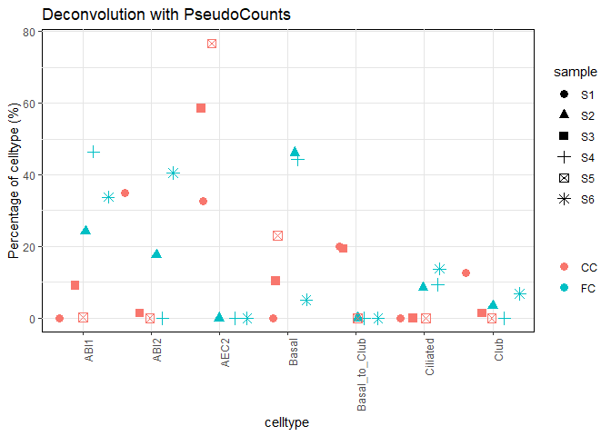<!-- --> Display
percentages per sample

``` r
RBE1.df.t.g$label <- factor(paste0(RBE1.df.t.g$condition, "_", RBE1.df.t.g$sample), levels = unique(paste0(RBE1.df.t.g$condition, "_", RBE1.df.t.g$sample)))


library(RColorBrewer)
n <- 9
qual_col_pals <- brewer.pal.info[brewer.pal.info$category == 'qual',]
col_vector = unlist(mapply(brewer.pal, qual_col_pals$maxcolors, rownames(qual_col_pals)))[1:n]
col_vector[4] <- "#00ACC1"
c <- ggplot(RBE1.df.t.g, aes(fill=celltype, y=value, x=label)) + 
  ylab("Cell Proportion (%)")+ xlab("")+
  geom_bar(position = "stack",stat = "identity") + 
  theme(axis.text.x = element_text(angle = 90, hjust = 1)) +
  theme(axis.text.x = element_text(color = c("red", "green", "blue", "brown", "orange", "black"))) +
  theme(panel.background = element_rect(fill = "white", size = 0.5, color = "black")) +
  theme(panel.grid.major = element_line(colour = "gray90")) + 
  theme(panel.grid.minor = element_line(colour = "gray90")) +
  scale_fill_manual(values=col_vector) + 
  theme(text = element_text(size=25))
c
```

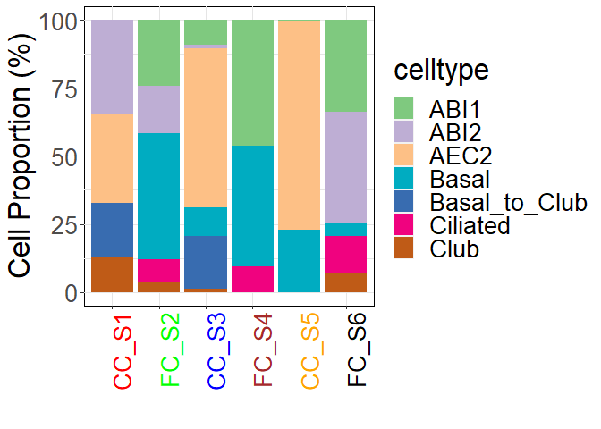<!-- -->
